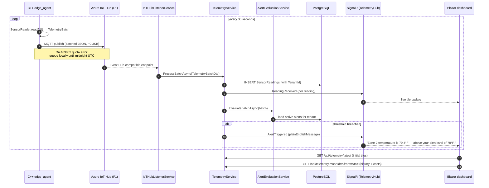

# Telemetry sequence — edge to dashboard

Local dev is the same sequence with two substitutions:
`Agent → /tmp/edgemonitor/readings/*.json → FileSystemListenerService` replaces the IoT Hub hop,
and the in-process SignalR hub replaces Azure SignalR.
